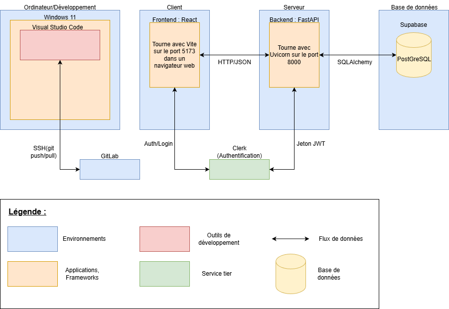

## Structure du projet

```
6ixResolve/
│
├── backend/
│   ├── src/
│   │   ├── database/       # Connexion et modèles SQLAlchemy
│   │   ├── routes/         # Routes API (auth, onboarding, etc.)
│   │   ├── services/       # Solar simulation et benchmark
│   │   └── main.py         # Point d’entrée FastAPI
│   ├── tests/              # Tests du backend
│   ├── .env
│   ├── requirements.txt
│   └── server.py
│
├── frontend/
│   ├── src/
│   │   ├── auth/           # Gestion Clerk
│   │   ├── components/     # Composants React
│   │   ├── layout/         # Structure / layout
│   │   └── pages/          # Pages principales
│   ├── .env
│   ├── index.html
│   ├── package.json
│   └── vite.config.js
│
└── docs/
    ├── backend/
    │   ├── api.md
    │   └── database.md
    ├── architecture.md
    ├── frontend.md
    └── index.md
```
</br>

## Schéma d'architecture :

</br>

